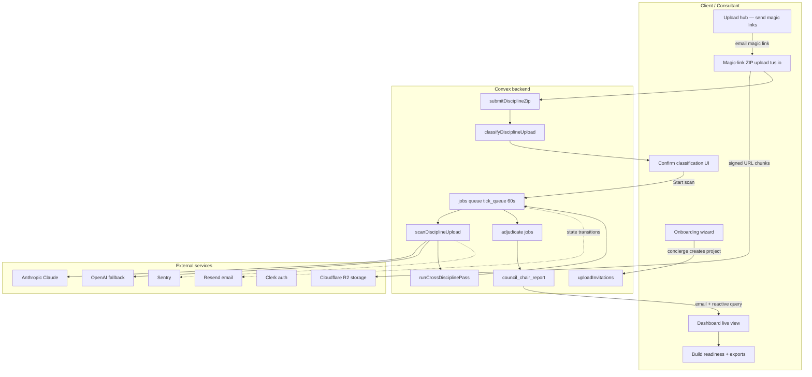

# VerifIQ — Launch Readiness Package

**Doc ID:** `verifiq-launch-readiness-v1.0`  
**Date:** 2026-06-06  
**Purpose:** Single index for flawless launch — wireframes, automation workflow, gap analysis, Playwright plan, Claude Code execution, and external review gates (Ruflo, GStack).

---

## How to use this package

1. **Walk the wireframes** — open `website/workflow-index.html` locally (`npx serve website -l 3000`).
2. **Read the gap analysis** — `docs/30-gap-analysis.md` — know what is spec'd vs built vs tested.
3. **Hand Claude Code** — paste `docs/32-claude-code-execution-plan.md` § kickoff prompt after env vars are set.
4. **Run Playwright** — implement per `docs/31-playwright-test-plan.md` before first paid pack.
5. **External review** — run Ruflo and GStack checklists (§ below) at Weeks 5, 8, and 12 gates.

---

## Wireframe inventory (client upload → release)

| Step | Screen | File | Build phase |
|------|--------|------|-------------|
| I | Request brief | `website/onboarding-wizard.html` | Phase 7a |
| II | Upload hub | `website/upload-hub.html` | Phase 7a |
| III | Magic-link ZIP | `website/upload-magic-link.html` | Phase 7a |
| IV | Confirm classification | `website/classify-confirm.html` | Phase 7b |
| V | Atelier console (live scan) | `website/dashboard-live.html` | Phase 7c |
| VI | Build readiness decision | `website/build-readiness.html` | Phase 7d |
| VII | Findings register + export | `website/scan-result-free.html` | Phase 7d |
| — | Workflow index | `website/workflow-index.html` | Reference |

**Design system:** `website/verifiq-system.css`, `website/verifiq-cad.css`, Atelier dark-gold shell (onboarding / dashboard-live pattern).

---

## Full automation workflow (end-to-end)

### State machine (canonical)

From `verifiq-prompts/20_platform_architecture.md` §5:

```
pending → uploading → classifying → confirm_classify → scanning
  → cross_ref → peer_challenge → adjudicate → reviewer_queue → released
```

### Automation map



### Per-discipline upload sequence (MVP path — coded today)

| # | Trigger | Action | Output |
|---|---------|--------|--------|
| 1 | Consultant opens magic link | Verify token, expiry, single-use | 410 if invalid |
| 2 | ZIP uploaded to storage | `submitDisciplineZip` | `disciplineUpload` record |
| 3 | Server extracts ZIP | Per-file storage + manifest | `files` table rows |
| 4 | Scheduler fires | `classifyDisciplineUpload` | discipline, docType, confidence |
| 5 | All files classified | Customer notified | → `confirm_classify` state |
| 6 | Customer confirms | Mutation `projects.startScan` | Job tree enqueued |
| 7 | `tick_queue` every 60s | `scanDisciplineUpload` per discipline | `findings` pending_review |
| 8 | All disciplines done | `runCrossDisciplinePass` | cross-discipline findings |
| 9 | Job deps met | peer_challenge → adjudicate | adjudicated register |
| 10 | Reviewer signs | `reviewer_queue` → `released` | Build Readiness Report + email |

### Email automation (Resend — Phase 7c)

| Transition | Template ID (create in Resend) |
|------------|-------------------------------|
| Magic link sent | `upload-invite` |
| Upload complete (per gate) | `upload-gate-complete` |
| All gates closed | `classify-ready` |
| Scan started | `scan-started` |
| Scan released | `pack-released` |
| Upload stalled >4h | `upload-stalled` |

### Job queue rules (non-negotiable)

- One Convex action **cannot** hold a full Tier III scan (24–48h).
- Per-discipline trees are **isolated** — Arch failure must not kill M&E.
- Every LLM call has **idempotency_key** = hash(model + prompt_version + doc_sha256 + agent + corpus_version).
- Audit-log writes are **mutations only** — survive action retries.

---

## Build tool recommendation

| Approach | Verdict | Notes |
|----------|---------|-------|
| **Claude Code phased** (doc 32) | ✅ Recommended primary | Matches `16_issuance_commands.md` phases; review at each gate |
| **Cursor Agent** (this repo) | ✅ Recommended for wireframes + docs + PR review | Same codebase; use for parallel UI polish |
| **Codex one-shot** | ❌ Not for launch | Scope creep risk on 11 screens + 7 platform mandatories |
| **Human founder** | ✅ Required | Panel chair gate, reviewer sign-off, first paid pack |

**Better than Claude Code alone:** Claude Code builds backend phases 1–6; Cursor implements Next.js screens from wireframes; Playwright CI blocks merge; founder runs validation pack manually before release.

---

## Review gates — Ruflo & GStack

> **Note:** Ruflo and GStack are not defined in this repo. Treat them as **mandatory external review passes** before launch. If they are named agents, services, or reviewers on your side, paste their comments into the template sections at the bottom of each checklist.

### Ruflo review — Reliability, resilience, observability

**When:** End of Weeks 5, 8, 12 (see PROJECT_PLAN.md).

| # | Check | Pass? | Comment |
|---|-------|-------|---------|
| R1 | tus.io upload resumes after simulated network drop | | |
| R2 | Upload survives tab close (Service Worker + IndexedDB) | | |
| R3 | SHA-256 mismatch triggers re-upload, not silent accept | | |
| R4 | Duplicate hash across tenants refused | | |
| R5 | Job queue survives Convex action timeout / retry | | |
| R6 | Per-discipline failure does not block unrelated disciplines | | |
| R7 | Idempotency cache prevents double-billing on LLM retry | | |
| R8 | Sentry captures frontend + Convex errors with project_id tag | | |
| R9 | Grafana dashboard shows scan duration, token cost, error rate | | |
| R10 | Email sent on every state transition (no silent stalls) | | |
| R11 | 15 GB Tier III upload completes on throttled 4G (load test) | | |
| R12 | Storage provider outage pauses upload + emails customer | | |

**Ruflo sign-off:** _________________ Date: _______

### GStack review — Full-stack integration & launch safety

**When:** End of Weeks 7, 8, 12.

| # | Check | Pass? | Comment |
|---|-------|-------|---------|
| G1 | Clerk auth protects all `/projects/*` routes | | |
| G2 | Magic links are single-use, hashed, expiring | | |
| G3 | R2 signed URLs expire; no permanent public blobs | | |
| G4 | EU data residency — Convex EU + R2 EU + Vercel region | | |
| G5 | No API keys in client bundle | | |
| G6 | Locked disclaimer on every output surface | | |
| G7 | Findings conform to `05_output_schemas.md` | | |
| G8 | Source-quote gate drops findings without verbatim quote | | |
| G9 | Build readiness = exactly one of 4 decisions | | |
| G10 | Validation pack (327 findings) CI test passes on preview deploy | | |
| G11 | Stripe webhook + Clerk webhook verified | | |
| G12 | 14-day doc deletion / 90-day hash retention enforced | | |

**GStack sign-off:** _________________ Date: _______

---

## Launch gates (hard)

From `PROJECT_PLAN.md` + `docs/25-implementation-review-council.md`:

| Gate | Week | Blocker if missed |
|------|------|-------------------|
| Panel chair conversation held | 1 | Revenue capped ~€14k/mo |
| Convex storage limits confirmed | 1 | 4-week regression in Phase 4 |
| tus.io + classification UX live | 5 | First 15 GB pack fails |
| Title-block classifier + scan state | 6 | Trust destroyed on mis-route |
| Observability + CI validation pack | 7 | First incident invisible |
| E2E on 327-finding pack | 8 | Regression hits paid customer |
| First paid pack signed | 12 | Public commitment |

---

## Document index

| Doc | Contents |
|-----|----------|
| **29** (this file) | Master index, automation workflow, review gates |
| **30** | Gap analysis — spec / wireframe / code / tests |
| **31** | Playwright test plan — suites, fixtures, CI |
| **32** | Claude Code execution plan — phased prompts + DoD |

---

## Claude Code handoff (one paragraph)

Paste into Claude Code after reading `docs/32-claude-code-execution-plan.md`:

> Implement VerifIQ Phases 1–8 per docs/32. Wireframes in `website/workflow-index.html` are the UI source of truth for upload → classify → scan → release. Close all P0 gaps in docs/30 before Phase 7 UI. Playwright tests in docs/31 must pass before declaring Week 8 gate. Do not ship without Ruflo R1–R12 and GStack G1–G12 sign-off templates completed.

---

*End of launch readiness package · v1.0*
