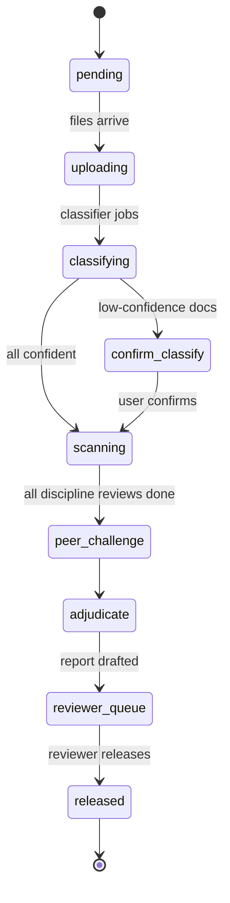
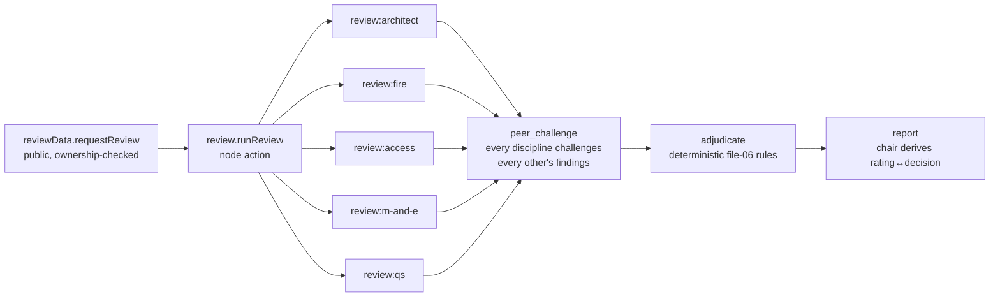
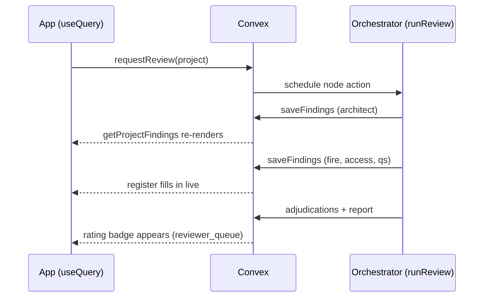

# Workflow automations — what runs by itself, and when

A map of every automated behaviour in the platform: what's live on the Convex
deployment today, what fires it, and what's planned next. Companion to the
mock run-through (docs/37) and the Stage 2 wireframes (docs/38).

## 1. The scan-state machine

Every project advances through this state machine (`schema.ts` `ScanState`,
file 20 §5). The UI's pipeline strip in the wireframes renders exactly this.

## 2. The review job DAG (automated, per scan)

One `requestReview` call fans out into this dependency graph; each node is a
job with retry/backoff, and a failed discipline is isolated (siblings still
run, the chair reports from the survivors):

Automated guarantees inside the DAG:

| Behaviour | Mechanism |
|---|---|
| Every candidate finding gated before emit | 7-check self-check (`src/agents/self-check.ts`); each decision audit-logged |
| Duplicate work never re-billed | `inference_cache` keyed on model+prompt+doc-hash+agent+corpus (30-day TTL) |
| Re-running a scan is free | Orchestrator is idempotent — completed stages are skipped, zero LLM re-calls |
| Provider outage survival | Per-call Anthropic→OpenAI failover; dual failure parks the pack in `reviewer_queue` |
| Every state transition recorded | `audit_log` writes are mutations (never actions) — non-negotiable trust artefact |

## 3. Scheduled automations (live in `src/convex/crons.ts`)

| Cron | Schedule | What it does |
|---|---|---|
| `resume stalled scans` | every 15 min | Re-dispatches `runReview` for any scan stuck in an active state (deploy restarts, action timeouts). Idempotent — finished stages never re-run. |
| `purge inference cache` | daily 03:00 UTC | Drops expired `inference_cache` rows (30-day TTL). |

## 4. Reactive UI updates (no polling code in the app)

The Stage 2 app never polls. Convex `useQuery` subscriptions re-render
automatically when the underlying tables change — so the findings register
fills in live, finding by finding, while the council runs:

## 5. Planned automations (not yet built)

| Automation | Trigger | Notes |
|---|---|---|
| Classification confirmation nudge | `confirm_classify` > N hours | Email via Resend (Phase 2 stack decision) |
| Report-released notification | `released` transition | Email (Resend) and/or webhook |
| Outbound webhooks to customer systems | finding/report events | Svix (EU region) — chosen for EU data residency + GDPR/SOC 2; one `audit_log`-driven dispatcher |
| Lessons-learnt loop | rejection feedback rows | files 14/15 — `findings_feedback` → prompt-version proposals (`prompt_versions` table already exists) |
| CI on every PR | GitHub Actions | already live: typecheck · lint · test · hygiene from a clean checkout |
